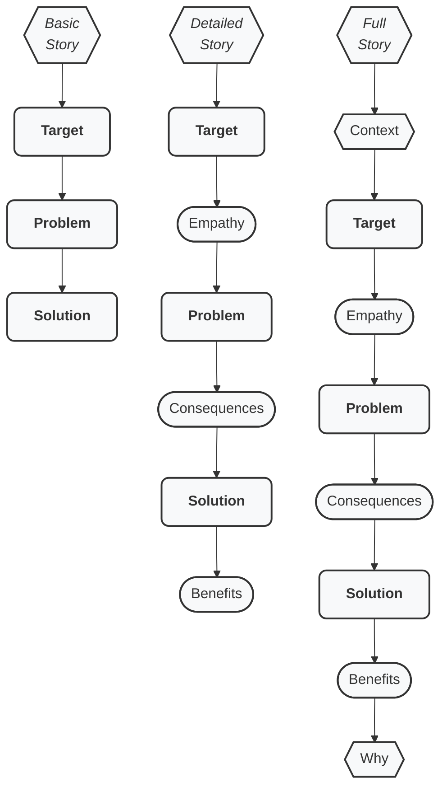
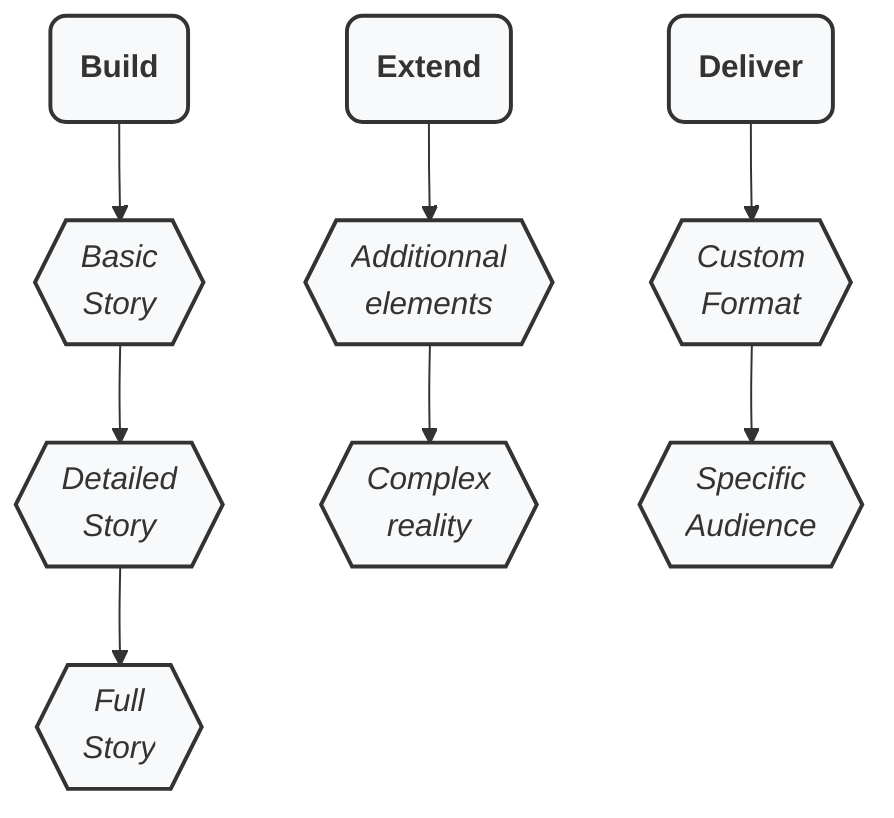

# Lean Storytelling

**Craft and deliver** compelling, efficient, convincing **stories** about your business, service, or product!

**Lean Storytelling**:

- **Shape and structure** your story, with the foundational building blocks, to **setup the core**.
- **Extend and complete** your story, with additional elements, and complexity, to **fine-tune**.
- **Specialise and deliver** your story, in various formats to different audiences, for **influence and leadership**.

> [!IMPORTANT]
> Learn fast, practice hard, get feedback, try again.

What is it? What for? What's in it for me? How do I start? Read more below...

---

## Table of Contents

1. Why?
2. Methodology overview
    - Build
    - Extend
    - Deliver
4. Q&A / FAQ
Overview

---

## Why?

### Core motivation

It was made, battled-tested, and refined so that people communicate clearly, in a standard and proven manner, the way humans have told stories since the dawn of humanity, by giving and taking stories, living the feeling of adventure.

### Who it is indended for

Lean Storytelling is designed for leaders and managers who want to be much more efficient in their communication style.

### How this works

Shape and structure your story, given the widely used, but implicit ingredients.
Then deliver your story in any format or context.

People know how to "receive" a story, as they are used to "receiving" novels, series, movies...
But people have difficulties to properly "send" stories by respecting the untold, implicit secrets, that humanity has used since forever.

### What Lean Storytelling is really

**Lean Storytelling** is a structured technique for crafting clear, compelling stories—especially for business, product, and service contexts. It draws on best practices to ensure your audience understands, resonates, and remembers your message.

> [!NOTE]
>  It is easy to learn, but challenging to master, requiring careful practice, learning from your audience, and persistence.

Lean Storytelling has been crafted for business, product, and service: whether you want pitch or test an idea, refine and develop , or delierv and promote
development and promotion

> [!CAUTION]
> Not for screenwriting or novel writing.

This helps align teams, reduce friction, and clarify the "why" behind any story.

### What's in it for me?

Become crystal clear in your communication, impact more, influence harder.

---

## Methodology overview

### Build your story

#### Basic Story

- **Target**: The user, the client, the buyer—the hero of your story, the one who experiences transformation
- **Problem**: The challenge or antagonism your Target faces
- **Solution**: Your offering (keep it concise; avoid over-explaining)

> [!IMPORTANT]
> The hero is essential to storytelling, in this context we are client-centric.

> [!CAUTION]
> Stay concise, if not laconic, about the Solution.

#### Detailed Story

- Target
  - **Empathy**: What the Target sees, feels, hears, and says
- Problem
  - **Consequences**: How the Problem impacts the target’s daily life, the pain that is felt
- Solution
  - **Benefits**: The tangible advantages your Solution provides to the Target

> [!TIP]
> Express Problem as a positive sentence form, not a negative way: "Problem is the lack og my Solution".
 
> [!WARNING]
> The Solution may not mean anything to your audience, rather explicit the ture Benefits and advantges.

#### Full Story

- **Context**: The environment in which the Target operates
- Target
    - Empathy
- Problem
    - Consequences
- Solution
   - Benefits
- **Why**: The core motivation or guiding principle behind your story

> [!NOTE]
> The hero returns from the adventure with a magic wand, light saber, or wisdom: what transformation has the Target undergo?

### Extend your story

#### Addons

In case an option is absolutely needed, and you can't live without:

**Optional Additions (use as needed):**
- **Challenge**: Pose an open question to engage your audience
- **Quote**: Validate an element with a relevant quote
- **Data**: Bring facts and figures that proves your point 
- **Alternatives**: Highlight unsatisfactory solutions the hero has tried
- **Competition**: Acknowledge competitors, but emphasize why your solution is superior
- **Unfair Advantage**: What makes your solution uniquely effective, and difficult to imitate
- **Warnings**: Potential pitfalls or risks
- **Self-Benefits**: How you also benefit from the solution
- **Call to Action**: What you want your audience to do next
- **Failure**: Share a past failure or setback to build credibility and context
- **Same-same**: The same type of people have lived the same story

#### Complex Story

Use with extreme care:

- In one story:
    - Use extension pack
    - Target multiple personas
    - Address multiple problems
    - Bring multiple Solutions
- Blend story arcs:
    - Merge stories with multiple common elements
    - Cross-over stories in the same timeline/universe
    - Sub-story or "mise en abyme"

### Deliver your story

#### Formats

Adapt your stories to various constraints:
- Text: ASCII, PDF, ODF
- Images: PNG, JPEG
- Videos
- Hybrid: slidedecks, illusrated texts

#### Audiences

Specialise story to:
- Stakeholders
- Buyers
- Investors
- Collaborators

### A picture is worth a thousand words

Build + Extend + Deliver = Get feedback and restart!

--- 

# Q&A / FAQ

## What is Lean Storytelling ("TopSol Playbook")?

Lean Storytelling ("TopSol Playbook") is a collection of recipes, templates, and best practices designed to help you craft effective stories for business, service, and product contexts. It serves as a practical field guide, not a rigid framework.

## Who is it for?

This approach is ideal for:
- Product Owners/Managers
- Scrum Masters and Agile coaches
- Designers
- Engineers
- Marketing professionals
- Sales teams
- Founders, and C-level executives
- Leaders and Managers
- Freelances

## Beyond storytelling: test your assumptions

Beyond only telling stories, Lean Storytelling is a powerful tool that helps you refine your assumptions and hypothesis, your unique or key value proposition, and/or unique selling point, by iterating on what is convincing with feedback loops.

## How is it used? From A to Z? What is it for? What's the goal?

**Applications:**
- Describe Backlog, Epics, User Stories in Agile teams (Scrum/Kanban), helping to visualize expected outcomes
- Test and get quick feedback on solutions or value propositions in customer interviews, supporting Lean Startup and Design Thinking
- Sell products, features, services or solutions
- Set the messaging, so you reach properly your target, and it's awin
- Do clean and lean developer advocacy, by sending the signals the right way
- Describe the experience you offer, with clear benefits

**Benefit:** Propser Storytellng synchronizes and aligns people.

## How can I deliver the story?

A well-crafted story can be delivered in various formats:
- **Spoken**: Podcasts, ads, videoconferences, videos, meetups, speeches, public speaking
- **Written**: Blog posts, slide decks, tickets, social media, specs
- **Visual**: Images, videos, schemas, drawings, infographies

## What does "TopSol Playbook" stand for?

This is the old name for Lean Storytelling.

- **Playbook**: Emphasizes practicality and avoids the term "framework"; it’s not an advanced storytelling technique.
- **TopSol**: An acronym for the core elements:
  - **To**: Target (the people or personas you’re addressing)
  - **P**: Problem (the challenge they face)
  - **Sol**: Solution (what you offer)

## Where does it come from?

Lean Storytelling builds on established methodologies:
- **Lean Canvas** by Ash Maurya ([free online course](https://www.udemy.com/lean-canvas-course/))
- **Monomyth (Hero’s Journey)** ([Wikipedia](https://en.wikipedia.org/wiki/Hero%27s_journey))
- **The Golden Circle** ("Why How What") by Simon Sinek ([TED Talk](https://www.ted.com/talks/simon_sinek_how_great_leaders_inspire_action))

## What can I do to help?

- Star this repository
- Share within your networks
- Ask questions or suggest improvements via [issues](https://github.com/Nyco/TopSol-Playbook/issues)
- Submit patches or merge requests
- Share your knowledge and experience
- Test the alpha app and send feedback

## Can I use, share, and modify Lean Storytelling?

Yes! Lean Storytelling is licensed under **Creative Commons Attribution-ShareAlike 4.0 International (CC BY-SA 4.0)**. You are free to:
- **Share**: Copy and redistribute in any medium or format
- **Adapt**: Remix, transform, and build upon the material for any purpose, including commercially

## Can you organize a workshop?

Yes.

- For up to 10 people
- Duration 1.5 hours
- Hands on, practice hard, straight to the point, learn by doing, peer review

Contact me: [LinkedIn](https://www.linkedin.com/in/nicolasverite/)

## Can you organize a keynote?

Keynote: 20 min or 40 min
- Roots of humanity storytelling
- Reverse-engineer Hollywood-style storytelling
- Master the craft and art of business storytelling

Contact me: [LinkedIn](https://www.linkedin.com/in/nicolasverite/)

## Can I get the Canvas?

Copy this file in you own drive: "Lean Storytelling Canvas TEMPLATE (please copy, do not edit)"

Ask me for the PDF, ODF, Docx versions

Ask me for Mural, Miro, Notion, etc.

## Can an app help me write my own stories?

Yes, this is being vibe-coded under AGPLv3 license: try now, contact me: [LinkedIn](https://www.linkedin.com/in/nicolasverite/)

## Is there a book?

If there is demand: contact me: [LinkedIn](https://www.linkedin.com/in/nicolasverite/)

## Can we partner?

Yes, contact me: [LinkedIn](https://www.linkedin.com/in/nicolasverite/)

