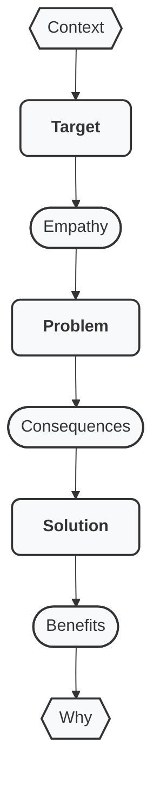

# Lean Storytelling: deliver compelling business stories

**Lean Storytelling**:
- Shape, structure, and refine the story you tell about your business/product/service
- Deliver and specialise in various formats, and wide ranges of audiences

## Why "Lean Storytelling"?

So that people communicate and listen, in a standard and proven way, by giving and taking stories, with the same and minimalistic approach

## Who it is indended for

Lean Storytelling is designed for leaders and managers who want to be much more efficient in their communication style

## How this works

Shape and structure your story, given the widely used, but with secret ingredients
Then deliver your story in any format or context

People know how to "receive" a story, as they are used to "receiving" novels, series, movies...
But people have difficulties to properly "send" stories by respecting the untold, implicit rules, that humanity has used since forever 

## What Lean Storytelling Is

**Lean Storytelling** is a structured technique for crafting clear, compelling stories—especially for business, product, and service contexts. It draws on best practices to ensure your audience understands, resonates, and remembers your message.

**Key Characteristics:**
- A practical set of recipes and templates to shape your story
- Easy to learn, but challenging to master—requiring practice and iteration
- Designed for business, product, and feature development (not for screenwriting or novel writing)
- Applicable from early-stage empathy and problem discovery through to delivery, testing, and communication
- Helps align teams, reduce friction, and clarify the "why" behind your story
- Inspired by Lean Canvas, the Monomyth (Hero’s Journey), and The Golden Circle
- Rooted in Agile, Lean Startup, Design Thinking, UX research, and entrepreneurship
- Intentionally simple, minimalist, and systemic in approach

---

## Overview of the playbook

**Core Principles:**
- Start with the basic story ingredients
- Add details to thicken the plot
- Polish with the finishing touch
- Continuously test, learn, and adapt based on feedback
- Refine your story to its essence
- For advanced storytelling, use the Extension Pack
- This method is lean and agile, tailored for business—not generic storytelling

---

## Story building

### 1. Basic Story

Setup the mandatory bricks

**Foundational Elements:**
- **Target**: The user or buyer—the hero of your story, the one who experiences transformation
- **Problem**: The challenge or antagonism your target faces
- **Solution**: Your offering (keep it concise; avoid over-explaining)

---

### 2. Detailed Story

Enrich with necessary information

**Enhanced Elements:**
- **Target**
  - **Empathy**: What the target sees, feels, hears, and says
- **Problem**
  - **Consequences**: How the problem impacts the target’s daily life, the pain that is felt
- **Solution**
  - **Benefits**: The tangible advantages your solution provides

---

### 3. Full Story

Finish your structure with valuable content

**Contextualized Elements:**
- **Context**: The environment in which the target operates
- **Target** (Empathy)
- **Problem** (Consequences)
- **Solution** (Benefits)
- **Why**: The core motivation or guiding principle behind your story

---

## Story Delivery

After you have finished structuring your story,...

### Story Sequencing

Deliver it in this specific order:

### Formats

Adapt your stories to various constraints:
- Text: ASCII, PDF, ODF
- Images: PNG, JPEG
- Videos
- Hybrid: slidedecks, illusrated texts

### Audiences

Specialise story to:
- Stakeholders
- Buyers
- Investors

---

## Extension Pack

### Extend you story

In case an option is absolutely needed, and you can't live without:

**Optional Additions (use as needed):**
- **Challenge**: Pose an open question to engage your audience
- **Quote**: Validate the problem or benefits with a relevant quote
- **Alternatives**: Highlight unsatisfactory solutions the hero has tried
- **Competition**: Acknowledge competitors, but emphasize why your solution is superior
- **Unfair Advantage**: What makes your solution uniquely effective, and difficult to imitate
- **Warnings**: Potential pitfalls or risks
- **Self-Benefits**: How you also benefit from the solution
- **Stages in AARRR**: Acquisition, Activation, Retention, Referral, Revenue
- **Call to Action**: What you want your audience to do next
- **Failure**: Share a past failure or setback to build credibility and context

### Complex Story

Use with extreme care:
- In one story:
    - Use extension pack
    - Target multiple personas
    - Address multiple problems
- Blend story arcs:
    - Merge stories with multiple common elements
    - Cross-over stories in the same timeline/universe

---

# Example story: how I have built Lean Storytelling

## Context
I work in product organisations at scale, where multiple disciplines collaborate under constant pressure to deliver and perform.

## Target
I am a product manager in this rapidly evolving tech industry, operating across both strategy and execution, discovery and delivery.

## Empathy
I sit at the intersection of many different teams and people — co-constructing with engineering (dev, QA, ops), designers, sales, marketing, and a range of stakeholders. Each speaks their own language and carries their own agenda.

## Problem
On one side, people push one-way communication without seeking feedback or confirmation it is correlty understood. On the other, people misread the information they receive without asking for clarification nor precision. People go fast and do not waste time, they make few effort to listen carefully, to truly sync — nor to speak in a way that others can actually understand.

## Consequences
Teams and leaders stay loosely coupled, rather staying within their own discipline and perspective. The organisation's network loses value, and the full outcome is far completely reached.

## Solution
I have built Lean Storytelling: a way of structuring a story as a shared language. It takes the form of a simple A4 canvas, accompanied by a workshop, grounded in proven best practices.

## Benefits
I can now easily and quickly shape stories that can be delivered in many forms — and when properly battle-tested, people don't just receive my story, they sync, align, and resonate with it.

## Why
Now I have that superpower to unlock the full potential of transdisciplinarity: going further, together, with greater quality.

--- 
# Q&A / FAQ

## What is Lean Storytelling ("TopSol Playbook")?

Lean Storytelling ("TopSol Playbook") is a collection of recipes, templates, and best practices designed to help you craft effective stories for business and product contexts. It serves as a practical guide, not a rigid framework.

---

## Who is it for?

This approach is ideal for:
- Product owners/managers
- Scrum masters and Agile coaches
- Designers
- Engineers
- Marketing professionals
- Sales teams
- Founders, and C-level executives
- Leaders and Managers

---

## Beyond storytelling

Beyond only telling stories, Lean Storytelling helps you refine your assumptions and hypothesis, your unique or key value proposition, and/or unique selling point, by iterating on what is convincing.

---

## How is it used? From A to Z?

**Applications:**
- Describe Backlog, Epics, User Stories in Agile teams (Scrum/Kanban), helping to visualize expected outcomes
- Test and get quick feedback on solutions or value propositions in customer interviews, supporting Lean Startup and Design Thinking
- Sell products, features, services or solutions

**Benefit:** It synchronizes and aligns people involved in the User Story pipeline.

---

## How can I deliver the story?

A well-crafted story can be delivered in various formats:
- **Spoken**: Podcasts, ads, videoconferences, videos, meetups, speeches, public speaking
- **Written**: Blog posts, slide decks, tickets, social media
- **Visual**: Images, videos, schemas, drawings, infographies

---

## What does "TopSol Playbook" stand for?

- **Playbook**: Emphasizes practicality and avoids the term "framework"; it’s not an advanced storytelling technique.
- **TopSol**: An acronym for the core elements:
  - **To**: Target (the people or personas you’re addressing)
  - **P**: Problem (the challenge they face)
  - **Sol**: Solution (what you offer)

---

## Where does it come from?

Lean Storytelling builds on established methodologies:
- **Lean Canvas** by Ash Maurya ([free online course](https://www.udemy.com/lean-canvas-course/))
- **Monomyth (Hero’s Journey)** ([Wikipedia](https://en.wikipedia.org/wiki/Hero%27s_journey))
- **The Golden Circle** ("Why How What") by Simon Sinek ([TED Talk](https://www.ted.com/talks/simon_sinek_how_great_leaders_inspire_action))

---

## What can I do to help?

- Star this repository
- Share within your networks
- Ask questions or suggest improvements via [issues](https://github.com/Nyco/TopSol-Playbook/issues)
- Submit patches or merge requests
- Share your knowledge and experience

---

## Can I use, share, and modify Lean Storytelling?

Yes! Lean Storytelling is licensed under **Creative Commons Attribution-ShareAlike 4.0 International (CC BY-SA 4.0)**. You are free to:
- **Share**: Copy and redistribute in any medium or format
- **Adapt**: Remix, transform, and build upon the material for any purpose, including commercially

---

## Can you organize a workshop?

Yes, for up to 10 people, lasting 1.5 hours.
Contact me via:
- [LinkedIn](https://www.linkedin.com/in/nicolasverite/)
- [Twitter](https://twitter.com/nyconyco)

---

## Can I get the Canvas?

Copy this file in you own drive: "Lean Storytelling Canvas TEMPLATE (please copy, do not edit)"

Ask me for the PDF, ODF, Docx versions

---

## Can an app help me write my own stories?

Yes, this is being planned
