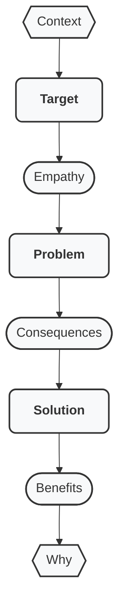

# Deliver Your Story

## Story Delivery

After you have finished structuring your story...

### Story Sequencing

Deliver it in this specific order:

### Formats

Adapt your stories to various constraints:
- Text: ASCII, PDF, ODF
- Images: PNG, JPEG
- Videos
- Hybrid: slidedecks, illustrated texts

### Audiences

Specialise story to:
- Stakeholders
- Buyers
- Investors
